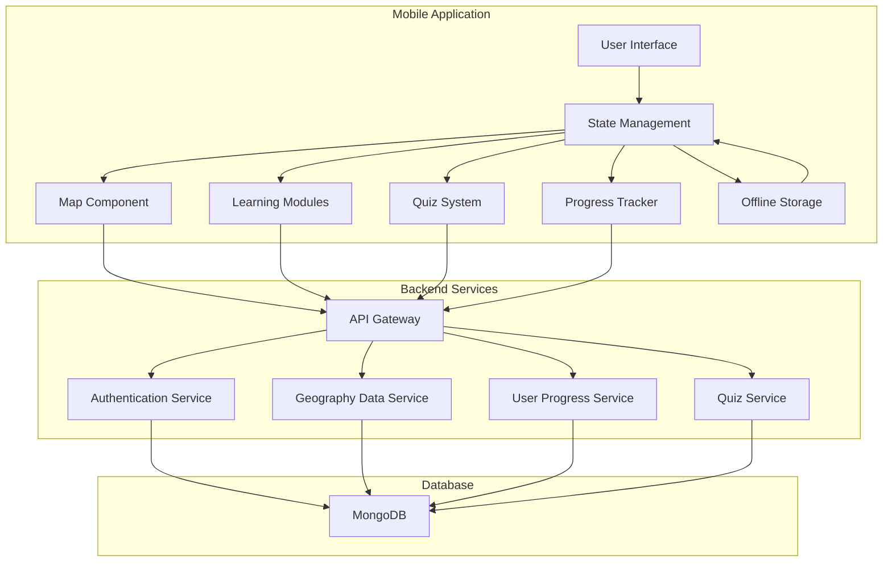

# Architecture: World Explorer

## Status: Draft

## Technical Summary

World Explorer is an interactive mobile application designed to help students learn about countries and cities worldwide through an engaging map-based interface. The architecture focuses on performance, cross-platform compatibility, user experience, and offline capabilities.

## Technology Stack

| Platform/Component | Technology           | Purpose                                    |
| ------------------ | -------------------- | ------------------------------------------ |
| Frontend           | React Native         | Cross-platform mobile development          |
| Maps               | React Native Maps    | Interactive world map implementation       |
| Backend            | Node.js/Express.js   | Server-side API and business logic         |
| Database           | MongoDB              | Data storage for geographic and user data  |
| API                | RESTful              | Communication between frontend and backend |
| Authentication     | JWT                  | User authentication and authorization      |
| Local Storage      | AsyncStorage/SQLite  | Offline data persistence                   |
| State Management   | Redux                | Frontend state management                  |
| Build System       | Metro (React Native) | Bundling and dependency management         |
| CI/CD              | GitHub Actions       | Automated testing and deployment           |
| Documentation      | JSDoc                | API reference and code documentation       |

## High-Level Architecture Diagram



## Architecture Components

### Frontend Components

- **UI Layer**: React Native components for cross-platform interface
- **Map Component**: Interactive globe/map with touch gestures
- **Learning Modules**: Country and city information displays
- **Quiz System**: Interactive quizzes with multiple difficulty levels
- **Progress Tracker**: User achievement and learning progress monitoring
- **Offline Storage**: Local data persistence for offline functionality

### Backend Components

- **API Gateway**: Entry point for all client requests
- **Authentication Service**: User registration, login, and session management
- **Geography Data Service**: Country and city data management
- **User Progress Service**: Tracking and persisting user learning progress
- **Quiz Service**: Quiz generation, scoring, and feedback

## Data Models

```
User {
  id: ObjectId
  username: String
  email: String
  passwordHash: String
  progress: {
    countriesExplored: [String]
    citiesExplored: [String]
    quizzesTaken: [QuizAttempt]
    achievements: [Achievement]
  }
}

Country {
  code: String
  name: String
  capital: String
  population: Number
  languages: [String]
  culturalFacts: [String]
  historicalHighlights: [String]
  geographicFeatures: [String]
  flag: String
  coordinates: {
    latitude: Number
    longitude: Number
  }
}

City {
  id: ObjectId
  countryCode: String
  name: String
  population: Number
  landmarks: [String]
  culturalSignificance: String
  historicalImportance: String
  coordinates: {
    latitude: Number
    longitude: Number
  }
}

Quiz {
  id: ObjectId
  type: String
  difficulty: String
  questions: [Question]
}

Question {
  id: ObjectId
  text: String
  type: String
  options: [String]
  correctAnswer: String/Number
  explanation: String
}

QuizAttempt {
  quizId: ObjectId
  date: Date
  score: Number
  answers: [UserAnswer]
}
```

## Offline First Strategy

- **Data Synchronization**: Two-way sync between local storage and backend
- **Conflict Resolution**: Last-write-wins with timestamp-based conflict resolution
- **Priority-based Caching**: Essential data cached first (country basics, maps)
- **Background Sync**: Automatic synchronization when connectivity is restored
- **Progress Persistence**: All user activity saved locally before syncing

## Project Structure

```
/world-explorer
  /src
    /components      # Reusable UI components
    /screens         # App screens/pages
    /navigation      # Navigation configuration
    /services        # API and business logic services
    /store           # State management (Redux)
    /utils           # Helper functions
    /assets          # Images, fonts, etc.
    /hooks           # Custom React hooks
    /types           # TypeScript type definitions
    /offline         # Offline functionality
  /server
    /controllers     # API endpoint handlers
    /models          # Data models
    /routes          # API route definitions
    /services        # Business logic
    /utils           # Helper functions
    /config          # Server configuration
  /docs              # Documentation
  /.github           # CI/CD configuration
  /.ai               # AI-assisted Docs & Planning
  /.cursor           # Cursor Config & Templates
```

## Change Log

| Date       | Change                       | Epic/Story | Notes                           |
| ---------- | ---------------------------- | ---------- | ------------------------------- |
| 2024-07-02 | Initial Draft                | Epic-1     | Created base document           |
| 2024-07-02 | Added Offline First Strategy | Epic-7     | Added offline mode architecture |
