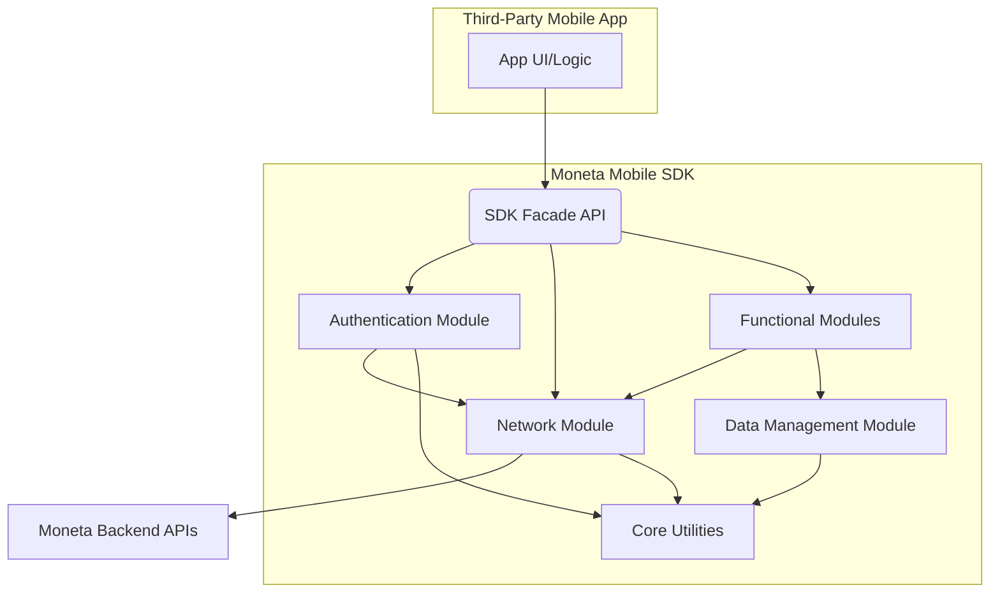

# Architecture: Moneta Mobile SDK

## Status: Draft

## Technical Summary
The Moneta Mobile SDK provides native libraries for iOS (Swift) and Android (Kotlin) to enable third-party integration of Moneta's financial services. The architecture focuses on security, performance, modularity, and a consistent developer experience across platforms.

## Technology Stack
| Platform/Component | Technology  | Purpose                                      |
|--------------------|-------------|----------------------------------------------|
| iOS SDK            | Swift       | Native iOS development                       |
| Android SDK        | Kotlin      | Native Android development                   |
| Network Layer      | Native HTTP | Secure API communication                     |
| Data Storage       | Native Secure Storage | Secure local data persistence (e.g., Keychain, Keystore) |
| Build System       | Gradle (Android), SwiftPM (iOS) | Dependency management and builds           |
| CI/CD              | TBD         | Automated testing and deployment             |
| Documentation      | TBD         | API reference and guides                     |

## High-Level Architecture Diagram


## Architecture Diagrams
[Add relevant architecture diagrams]

## Data Models/Schemas
- TBD: Define core data structures and serialization formats.

## Project Structure
```
/moneta-ios-sdk
  /Sources       # Swift Source Code
  /Tests         # Unit & Integration Tests
  Package.swift  # Swift Package Manager Manifest

/moneta-android-sdk
  /sdk           # Main SDK Module
  /app           # Sample Application Module
  build.gradle   # Project Build Script
  settings.gradle

/docs            # Documentation
/.ai             # AI-assisted Docs & Planning
/.cursor         # Cursor Config & Templates
```

## Change Log
| Date       | Change        | Epic/Story | Notes                |
|------------|---------------|------------|----------------------|
| $(date +%Y-%m-%d) | Initial Draft | Epic-1     | Created base document|
